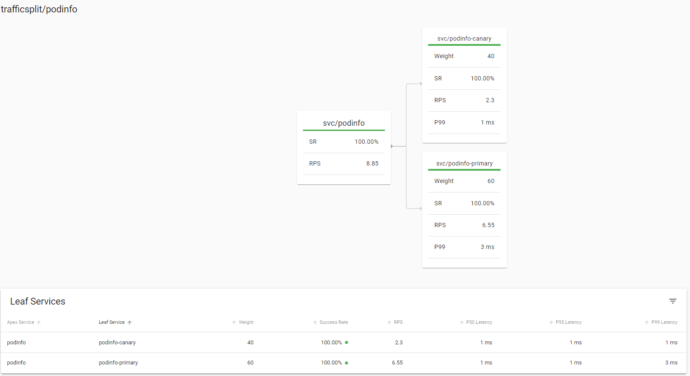

# devOps-with-kubernetes

https://devopswithkubernetes.com/

## 3.06: DBaaS vs DIY

In a low demand level projects like our course work DBaaS & DYI seems to be pretty easy to initialize and cost of initialization aren't significant. If demands are higher DIY solution requires considerable time investment in a terms of designing and configuring. In a other hand DBaaS offer many ready-to-use services that don't have to be build and maintained by yourself.

DBaaS like Google Cloud SQL are optimized for the Google Cloud infrastructure, so it might be easier to manage and to operate than a DIY. In a unconventional setups DIY offers flexibility that might be not accomplished with DBaaS. Creating and managing backups seems to be more simple with DBaaS as DIY requires lot of configuration.

In a small project DIY costs seems to be lower and easier to keep track off than DBaaS. When things get larger and more complex, DIY setups demand more resources, like people and time, to be maintained. Also DBaaS costs are likely to be more predictable.

## Exercise 3.07

Decided to go with PersistentVolumeClaims because the setup is fast and easy and I'm not in a need of all the complex features what Google Cloud SQL offers. Also feels like I could save a credit or two using PersistentVolumeClaims.

## Exercise 3.10

## Exercise 4.03

`scalar(count(kube_pod_info{created_by_kind="StatefulSet", namespace="prometheus"}))`

## Exercise 4.06

## Exercise 4.07
https://github.com/tatuNo/kube-cluster-todo

## Exercise 5.03

Demo app traffic split visualized.

## Exercise 5.04: Rancher vs OpenShift

For this exercise i chose Rancher over OpenShift.

- Installation seems to be easier with Rancher as it gets installed in hours where OpenShift could take days.
- Rancher natively offers Multi-Cluster Management from a single management instance, with OpenShift you need to purchase additional software (RHACM).
- There is no vendor lock with Rancher, switching to vanilla Kubernetes is possible.
- Rancher seems to be more easier & reliable to upgrade.

Picking one over another without context is quite hard and choice of platform is determined based on uses.

## Exercise 5.06

Directly used (green)
 - Kubernetes.
 - PostgreSQL for todo & ping-pong apps database management.
 - Nats to send todo app status messages to Discord.
 - Helm to install apps to cluster like Prometheus & Nginx.
 - Argo for rolling updates in part 4.
 - Flux to GitOpsify cluster in part 4.
 - Github Actions to create deployment pipelines.
 - K3s as a Kubernetes distribution for the course.
 - Knative for making ping-pong app serverless.
 - Contour as a Knative ingress class.
 - Traefik as it is k3s default ingress controller.
 - Nginx to serve todo app frontend static files. Also tested it as a ingress controller in part 3.
 - Linkerd to test Service Mesh in part 5.
 - Google Kubernetes Engine as a managed Kubernetes service for part 3.
 - Google Persistent Disk for persisting data in GKE.
 - Google Container Registery to store docker images in part 3.
 - Prometheus to monitor cluster in part 2 & 4.
 - Grafana loki to view app logs in part 2.

Outside of the course
 - MariaDB
 - MongoDB
 - MySQL
 - Redis
 - Gitlab
 - Jenkins
 - Heroku

Finding indirect use was quite challenging but found out that I used indirectly (yellow)
 - CoreDNS as cluster DNS provider in K3s.
 - Containerd as a container runtime in K3s.
 - Etcd via k3s -> flannel. To "store the network configuration, the allocated subnets, and any auxiliary data (such as the host's public IP)."
 - Might be that I used CNI too because of "by default, K3s will run with flannel as the CNI" but I have no idea about the concept.

