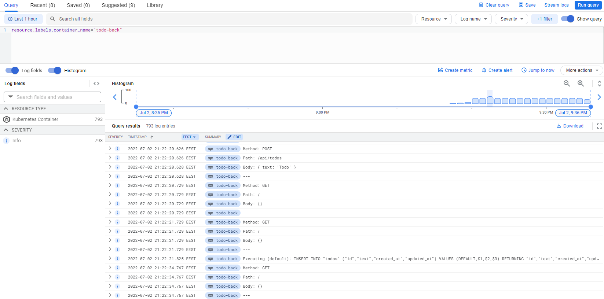
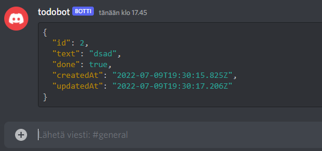

# devOps-with-kubernetes

https://devopswithkubernetes.com/

## 3.06: DBaaS vs DIY

In a low demand level projects like our course work DBaaS & DYI seems to be pretty easy to initialize and cost of initialization aren't significant. If demands are higher DIY solution requires considerable time investment in a terms of designing and configuring. In a other hand DBaaS offer many ready-to-use services that don't have to be build and maintained by yourself.

DBaaS like Google Cloud SQL are optimized for the Google Cloud infrastructure, so it might be easier to manage and to operate than a DIY. In a unconventional setups DIY offers flexibility that might be not accomplished with DBaaS. Creating and managing backups seems to be more simple with DBaaS as DIY requires lot of configuration.

In a small project DIY costs seems to be lower and easier to keep track off than DBaaS. When things get larger and more complex, DIY setups demand more resources, like people and time, to be maintained. Also DBaaS costs are likely to be more predictable.

## Exercise 3.07

Decided to go with PersistentVolumeClaims because the setup is fast and easy and I'm not in a need of all the complex features what Google Cloud SQL offers. Also feels like I could save a credit or two using PersistentVolumeClaims.

## Exercise 3.10

## Exercise 4.03

`scalar(count(kube_pod_info{created_by_kind="StatefulSet", namespace="prometheus"}))`

## Exercise 4.06

## Exercise 4.07
https://github.com/tatuNo/kube-cluster-todo